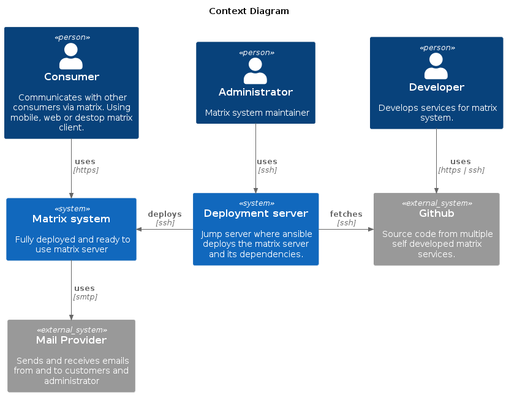
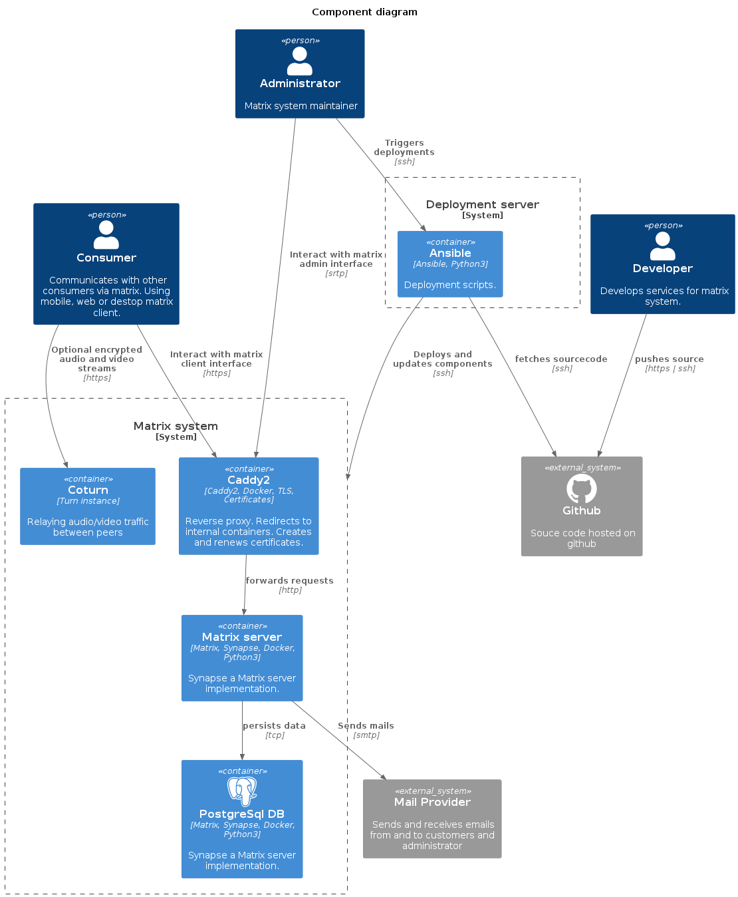

# Custom Matrix server

## Vision

Keep it as simple as possible regarding deployment, maintainability and implementing [Application Services (AS)](https://matrix.org/docs/guides/application-services)

To achieve this
  - Use official components only
  - No custom code just configuration
  - Automatic rollout of custom applications (AS)

## [How to deploy](./deployment/README.md)

## Features

- [X] Only official docker images are used
- [X] Out of the box synapse deployment
- [X] Automatic TLS generation and renewal with caddy
- [X] Mail support
- [X] Postgres included
- [X] Encrypted audio and video with coturn and certificates (caddy)

## [Roadmap](https://github.com/Trenrod/matrixserver/projects?query=is%3Aopen)

## Overview

Diagrams made with [C4-PlantUML](https://github.com/plantuml-stdlib/C4-PlantUML) 

### The software system in scope

###  Containers within the software system in scope

